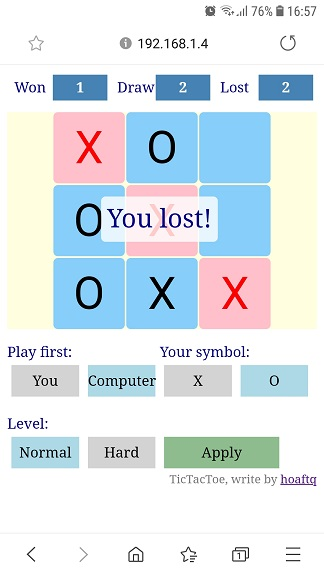

This is an implementation of Minimax algorithm. It is responsive and supports both computer and mobile.  
Here is how it looks like on a mobile  

The program is written without any library and structed after MVC pattern
- **Controller**  
    *game.js* connect logic and view together
- **Model**  
    *game.logic.js* contain the main logic
- **View** is seperated into 3 files
    - *game.view.js* Display main game board in the center
    - *game.options.js* Display those options below the board
    - *game.results.js* Display game results on the top

### To-do list
- [ ] Improve GUI
- [ ] Make it be able to embed to another web page
