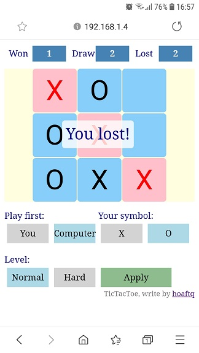

This is an implementation of Minimax algorithm. The program is structed after MVC pattern where
- Controller: game.js
- Logic: game.logic.js
- View: game.view.js, game.options.js, game.results.js

It is responsive and supports both computer and mobile

Here is how it looks like on a mobile

